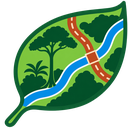

  

<h1 align="center">Forest Planner</h1>

  <strong>Del censo forestal al plan de manejo</strong> 
  Complemento de QGIS para la planificacion de aprovechamiento forestal en la Amazonia

  <a href="docs/README.md">Manual</a> &middot;
  <a href="https://github.com/YuriCaller/yf_forest_planner/issues">Reportar un problema</a>

---

## Que hace

A partir de un modelo digital de elevacion y de la capa de censo cargada en
QGIS, Forest Planner deriva la cadena completa que sostiene un plan de manejo:

- **Red hidrica y fajas marginales** con ordenes de Strahler y Shreve
- **Humedad, aguajales y zonas inundables** por HAND y capas tematicas
- **Patios y centros de acopio** con restricciones de volumen, arrastre,
  pendiente y distancia a cauce
- **Superficie de costo y red de vias** con rasante longitudinal real,
  distinguiendo subida y bajada cargado
- **Areas de impacto** desglosadas por componente
- **Densidad e intensidad de aprovechamiento** sobre malla de una hectarea,
  verificadas contra el limite normativo
- **Rendimiento y viajes de transporte**, con el limite por peso o por volumen

Genera informe en HTML y Word con trazabilidad de insumos, y cuadros en Excel
para el plan operativo.

> **Los trazos, ubicaciones y cantidades que produce son propuestas tecnicas
> sujetas a verificacion y replanteo en campo. No constituyen un diseno
> definitivo.**

## Instalacion

Descargue el complemento desde
[Releases](https://github.com/YuriCaller/yf_forest_planner/releases) e instalelo
en QGIS con **Complementos → Administrar e instalar complementos → Instalar a
partir de ZIP**.

Marque **Mostrar complementos experimentales** en la configuracion mientras el
complemento este en esa fase.

### Requisitos

- QGIS 3.34 o posterior, **incluido QGIS 4** sobre Qt6
- Proveedor de procesamiento **GRASS** activo (viene con la instalacion estandar)
- `numpy` y `scipy`, incluidos en QGIS

El complemento incluye un **diagnostico del entorno** que verifica todo esto y
señala lo que falte.

## Validacion

Los parametros por defecto no son supuestos: se calibraron contra literatura
amazonica y se contrastaron con operaciones reales en Madre de Dios, Peru.

| Magnitud | Modelo | Referencia |
|---|---|---|
| Umbral de cauce | 22.5 ha | 86.8% del cauce levantado en campo, quebrada Shicopreto |
| Arrastre medio | 162 m | 160 m, Braz (1997), Embrapa Acre |
| Area de patios | 18.7 m²/ha | 24 m²/ha, Johns et al. (1996), Paragominas |
| Densidad de red vial | 15.0–15.5 m/ha | 13.2 y 15.3 m/ha, concesion Paujil, PCA 07 y 08 |
| Sinuosidad de vias | 1.31 | 1.17 y 1.30, concesion Paujil |

La densidad vial y la sinuosidad se reprodujeron sobre una concesion que **no
se uso para calibrar**, lo que constituye una validacion independiente.

## Compatibilidad

Probado en QGIS 3.44 (Qt5) y QGIS 4.2 (Qt6). Los enumerados de Qt se resuelven
por atributo, de modo que el mismo codigo funciona en ambas ramas sin duplicar
rutas.

## Manual

El [manual](docs/README.md) documenta cada pestana, los parametros y las
referencias de calibracion. Cada pestana del complemento enlaza directamente a
su seccion.

## Alcance y limitaciones

- Las distancias de arrastre son **euclidianas**; la distancia real por via la
  resuelve el modulo de caminos
- El area basal removida y la abundancia por especie **no son verificables con
  un censo comercial**: requieren inventario estadistico
- Los diametros minimos de corta que trae el complemento son el **minimo legal,
  no necesariamente el sostenible**
- La ausencia de restricciones en las capas consultadas **no acredita su
  inexistencia en el terreno**

## Autor

**Yuri Fabian Caller Cordova** — CIP 214377
Ingeniero forestal y especialista en SIG
Puerto Maldonado, Madre de Dios, Peru
[gis-amazonia.pe](https://gis-amazonia.pe)

## Licencia

GNU General Public License v2.0 o posterior. Ver [LICENSE](LICENSE).
